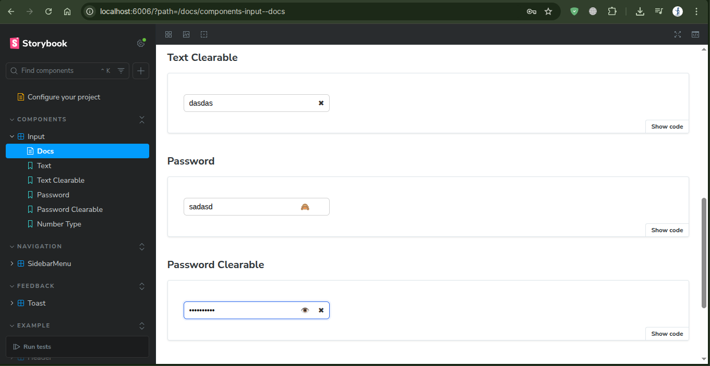
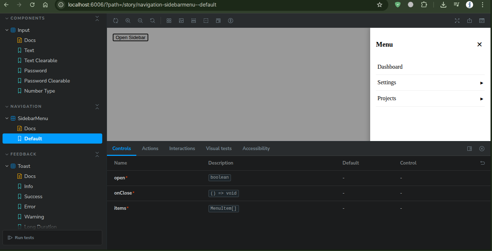
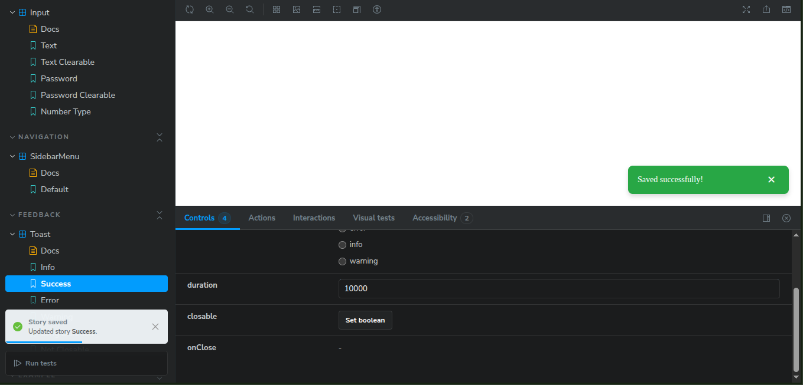
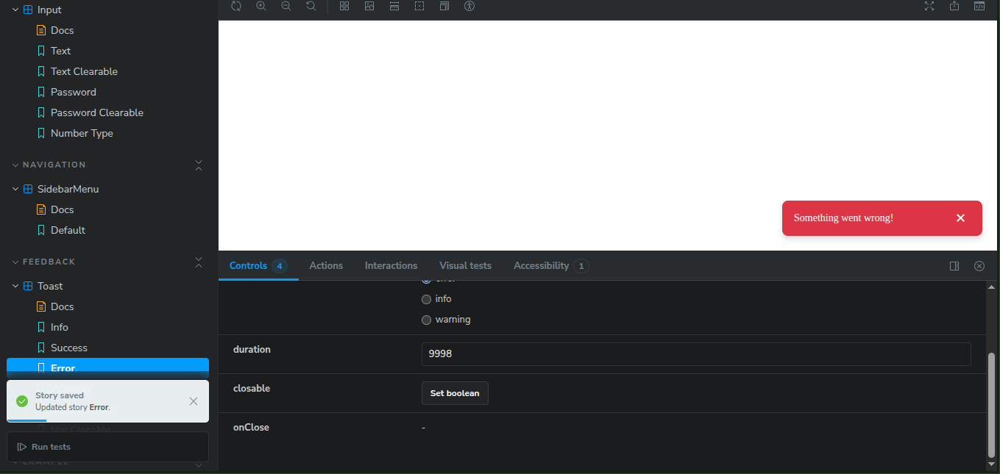
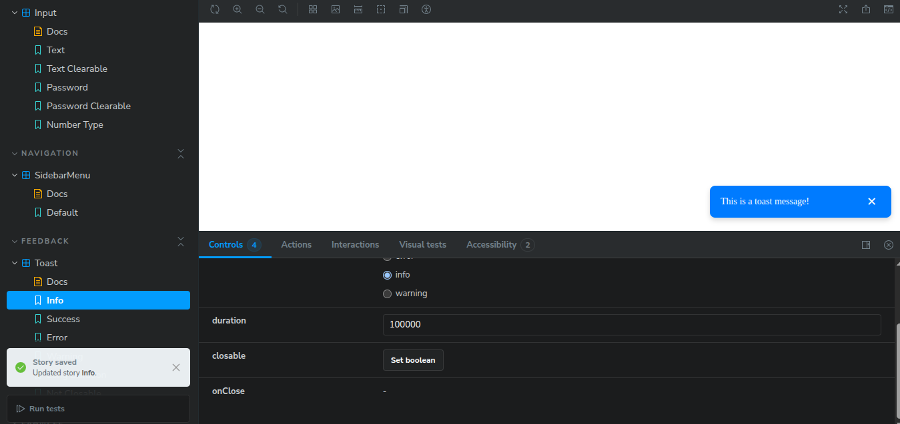
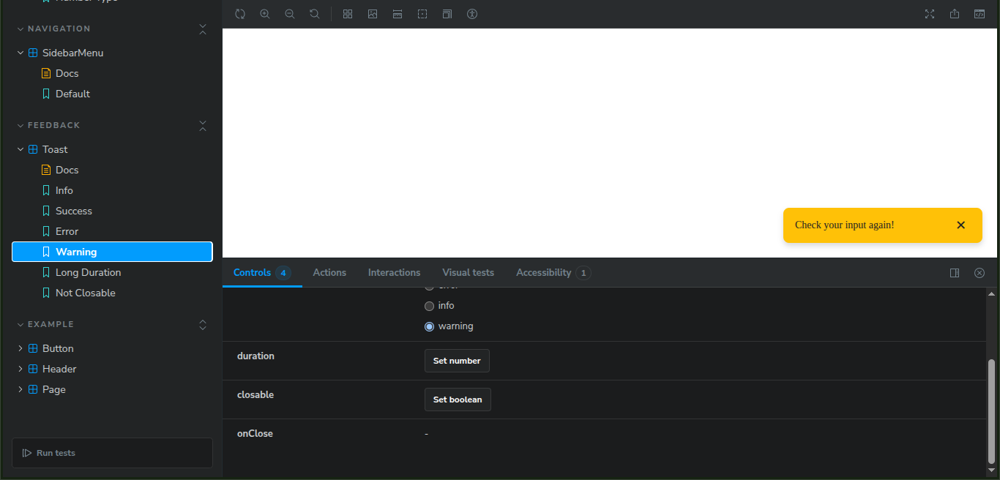

# ⚛️ React Component Library (Storybook UI System)

Reusable UI component system built with **React + TypeScript + Storybook**.  
Includes several interactive components designed with scalability and reusability in mind.

---


## 🚀 Setup

```bash
git clone https://github.com/<your-username>/<your-repo>.git
cd <your-repo>
npm install
npm run storybook
Storybook will start on http://localhost:6006

✅ All devDependencies (ESLint, Storybook, TypeScript, etc.) install automatically with npm install.

🧩 Components Overview
🔹 Input Component
Smart input with clear button and password visibility toggle.


🔹 Sidebar Menu
Dynamic sidebar with submenus and animated transitions.

<div align="center">  <br/>  </div>
🔹 Toast Notifications
Notification system with multiple visual states.

<div align="center">     </div>
